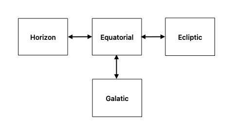

# Coordinate Systems

```{r include = FALSE}
source("_common.R")
```

## Summary

{#fig-coordsys}

## Using Rotation Matrices to Transform Coordinates

### Rotation Matrices

$$
R_x(\theta) =
\begin{bmatrix}
1 & 0 & 0 \\
0 & \cos\theta & \sin\theta \\
0 & -\sin\theta & \cos\theta
\end{bmatrix}
$$ {#eq-rotmatx}

$$
R_y(\theta) =
\begin{bmatrix}
\cos\theta & 0 & -\sin\theta \\
0 & 1 & 0 \\
\sin\theta & 0 & \cos\theta
\end{bmatrix}
$$ {#eq-rotmaty}

$$
R_z(\theta) =
\begin{bmatrix}
\cos\theta & \sin\theta & 0 \\
-\sin\theta & \cos\theta & 0 \\
0 & 0 & 1
\end{bmatrix}
$$ {#eq-rotmatz}

### Equatorial to Ecliptic Conversion

Equatorial coordinates are given by right ascension $\alpha$ and declination $\delta$.

1. Convert equatorial coordinates $\alpha$ and $\delta$ to cartesian coordinates $x$, $y$, and $z$.

$$
\begin{bmatrix}
x_\text{equatorial} \\
y_\text{equatorial} \\
z_\text{equatorial}
\end{bmatrix}
=
\begin{bmatrix}
\cos\delta \cos\alpha \\
\cos\delta \sin\alpha \\
\sin\delta
\end{bmatrix}
$$ {#eq-equat2eclip1}

2. Apply the rotation matrix $R_x(\theta)$ where the angle of rotation is the obliquity of the ecliptic $\varepsilon$.

$$
R_x(\varepsilon) =
\begin{bmatrix}
1 & 0 & 0 \\
0 & \cos\varepsilon & \sin\varepsilon \\
0 & -\sin\varepsilon & \cos\varepsilon
\end{bmatrix}
$$ {#eq-equat2eclip2}

$$
\begin{bmatrix}
x_\text{ecliptic} \\
y_\text{ecliptic} \\
z_\text{ecliptic}
\end{bmatrix}
=
R_x(\varepsilon)
\begin{bmatrix}
x_\text{equatorial} \\
y_\text{equatorial} \\
z_\text{equatorial}
\end{bmatrix}
$$ {#eq-equat2eclip3}

3. Convert the ecliptic cartesian coordinates to ecliptic longitude $\lambda$ and ecliptic latitude $\beta$.

$$
\lambda = \arctan\!\left(\frac{y_\text{ecliptic}}{x_\text{ecliptic}}\right)
$$

$$
\beta = \arcsin\!\left(\frac{z_\text{ecliptic}}{r}\right)
$$
$$
r = \sqrt{x_\text{ecliptic}^2 + y_\text{ecliptic}^2 + z_\text{ecliptic}^2}
$$

## Rectangular Coordinates to Polar Coordinates

$$
x = r \sin \theta \cos \varphi
$$ {#eq-rec2polar1}

$$
y = r \sin \theta \sin \varphi
$$ {#eq-rec2polar2}

$$
z = r \cos \theta
$$ {#eq-rec2polar3}

## Polar Coordinates to Rectangular Coordinates

$$
r = \sqrt{(x^2 + y^2 + z^2)}
$$ {#eq-polar2rect1}

$$
\cos \theta = \frac{x}{r}
$$ {#eq-polar2rect2}

$$
\cos \varphi = \frac{x}{\sqrt{(x^2 + y^2)}}
$$ {#eq-polar2rect3}

$$
\sin \varphi = \frac{y}{\sqrt{(x^2 + y^2)}}
$$ {#eq-polar2rect4}

$$
\tan \varphi = \frac{y}{x}
$$ {#eq-polar2rect5}

------------------------------------------------------------------------

-   $x$ = x coordinate, horizontal

-   $y$ = y coordinate, depth

-   $z$ = z coordinate, vertical

-   $\theta$ = vertical

-   $\varphi$ = horizontal

-   $r$ = radius

## Equatorial to Ecliptic Conversion

$$
\tan \lambda = \frac{\sin \alpha \cos \varepsilon + \tan \delta \sin \varepsilon}{\cos \alpha}
$$ {#eq-equat2eclipt1}

$$
\sin \beta = \sin \delta \cos \varepsilon - \cos \delta \sin \varepsilon \sin \alpha
$$ {#eq-equat2eclipt2}

## Ecliptic to Equatorial Conversion

$$
\tan \alpha = \frac{\sin \lambda \cos \epsilon - \tan \beta \sin \epsilon}{\cos \lambda}
$$ {#eq-eclipt2equat1}

$$
\sin \delta = \sin \beta \cos \varepsilon + \cos \beta \sin \varepsilon \sin \lambda
$$ {#eq-eclipt2equat2}

------------------------------------------------------------------------

-   $\alpha$ = right ascension

-   $\delta$ = declination

-   $\epsilon$ = obliquity of the ecliptic

-   $\lambda$ = ecliptic longitude

-   $\beta$ = ecliptic latitude

## Equatorial to Horizon Conversion

$$
\sin h = \sin \delta \, \sin \phi + \cos \delta \, \cos \phi \, \cos H
$$

$$
\cos A = \frac{\sin \delta - \sin \phi \, \sin h}{\cos \phi \, \cos h}
$$ where

$$
\ H = LST - \alpha
$$ {#eq-hor2equat3}

## Horizon to Equatorial Conversion

$$
\sin \delta = \sin h \cos \phi + \cos h \cos \phi \cos A
$$ {#eq-hor2equat1}

$$
\cos H = \frac{\sin h - \sin \phi \, \sin \delta}{\cos \phi \, \cos \delta}
$$ {#eq-hor2equat2}

------------------------------------------------------------------------

+------------+----------------------------+--------------+------------------------------------------------------+
| System     | Coordinates                | Type         | Range                                                |
+============+============================+==============+======================================================+
| Equatorial | Right Ascension - $\alpha$ | Geocentric   | $\alpha$ $\in$ \[0, 2$\pi$\]                         |
|            |                            |              |                                                      |
|            | Declination - $\delta$     |              | $\delta$ $\in$ \[-$\frac{\pi}{2}$, $\frac{\pi}{2}$\] |
+------------+----------------------------+--------------+------------------------------------------------------+
| Equatorial | Hour Angle - H             | Topocentric  | H $\in$ \[0, 2$\pi$\]                                |
|            |                            |              |                                                      |
|            | Declination - $\delta$     |              | $\delta$ $\in$ \[-$\frac{\pi}{2}$, $\frac{\pi}{2}$\] |
+------------+----------------------------+--------------+------------------------------------------------------+
| Horizon    | Azimuth - A                | Topocentric  | A $\in$ \[0, 2$\pi$\]                                |
|            |                            |              |                                                      |
|            | Altitude - h               |              | h $\in$ \[-$\frac{\pi}{2}$, $\frac{\pi}{2}$\]        |
+------------+----------------------------+--------------+------------------------------------------------------+
| Ecliptic   | Longitude - $\lambda$      | Geocentric   | $\lambda$ $\in$ \[0, 2$\pi$\]                        |
|            |                            |              |                                                      |
|            | Latitude - $\beta$         |              | $\beta$ $\in$ \[-$\frac{\pi}{2}$, $\frac{\pi}{2}$\]  |
+------------+----------------------------+--------------+------------------------------------------------------+
| Ecliptic   | Longitude - l              | Heliocentric | l $\in$ \[0, 2$\pi$\]                                |
|            |                            |              |                                                      |
|            | Latitude - b               |              | b $\in$ \[-$\frac{\pi}{2}$, $\frac{\pi}{2}$\]        |
+------------+----------------------------+--------------+------------------------------------------------------+

: Coordinate Systems {#tbl-coordsyss .striped .hover}
