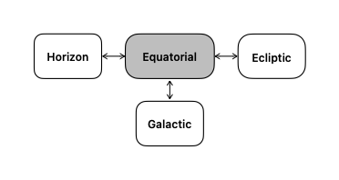

# Coordinate Systems

------------------------------------------------------------------------

@fig-coordsys illustrates common coordinate systems used in astronomy and also how to convert between the coordinate systems.

{#fig-coordsys}

## Horizon Coordinate System

The horizon system is a left-handed system centered on the observer where the x-axis points to the north on the observer's horizon, the y-axis points to the east on the observer's horizon, and the z-axis points to the observer's zenith.

The longitudinal coordinate called the azimuth A represents the angle measured from the north point of the horizon and passing eastward to the object's hour circle. Azimuth ranges from 0 to $2\pi$ radians or 0 - $360^\circ$.

The latitudinal coordinate called altitude $\alpha$ represents the angle from the horizon up to the object. Altitude ranges from $\pm \, \frac{\pi}{2}$ or $\pm \, 90^\circ$, with negative values indicating the object is below the horizon.

## Equatorial Coordinate System

The equatorial system is a right-handed system centered on the celestial equator where the x-axis points toward the vernal equinox, the y-axis points $90^\circ$ to the east, and the z-axis points to the celestial pole. The vernal equinox is the point where the Sun crosses the celestial equator moving northward.

The longitudinal coordinate called the right ascension $\alpha$ is measured eastward from the vernal equinox on the celestial equator. The right ascension ranges from 0 to $2\pi$ radians or 0 - $360^\circ$.

The latitudinal coordinate called the declination $\delta$ is the angular distaince north or south of the celestial equator. Declination ranges from $\pm \, \frac{\pi}{2}$ or $\pm \, 90^\circ$.

Equatorial coordinates are fixed in that they are independent of time and an observer's location. However, Earth's axis is not fixed due to the effects of precession and nutation, which means that equatorial coordinates are linked to a specific epoch such as J2000.

## Ecliptic Coordinate System

## Galactic Coordinate System

## Coordinate System Conversions

### Converting Rectangular Cartesian Coordinates to Spherical Coordinates

$$\mathsf{r = \sqrt(x^2 + y^2 + z^2)}$$

$$\mathsf{\alpha = tan^{-1}\dfrac{y}{x}}$$

$$\mathsf{\delta = tan^{-1}\dfrac{z}{r}}$$

### Converting Polar Coordinates to Rectangular Cartesian Coordinates

$$\mathsf{x = r\, cos\, \alpha\, sin\, \delta}$$

$$\mathsf{x = r\, sin\, \alpha\, sin\, \delta}$$

$$\mathsf{z = r\, cos\, \delta}$$

### Converting Equatorial Coordinates to Ecliptic Coordinates

$$\begin{bmatrix} \mathsf{x_{ecliptic}} \\ \mathsf{y_{ecliptic}} \\ \mathsf{z_{ecliptic}} \end{bmatrix} = \mathsf{R_x} \, (\epsilon) \, \begin{bmatrix} \mathsf{x_{equatorial}} \\ \mathsf{y_{equatorial}} \\ \mathsf{z_{equatorial}}  \end{bmatrix}$$

### Converting Ecliptic Coordinates to Equatorial Coordinates

$$\begin{bmatrix} \mathsf{x_{equatorial}} \\ \mathsf{y_{equatorial}} \\ \mathsf{z_{equatorial}} \end{bmatrix} = \mathsf{R_x} \, (-\epsilon) \, \begin{bmatrix} \mathsf{x_{ecliptic}} \\ \mathsf{y_{ecliptic}} \\ \mathsf{z_{ecliptic}}  \end{bmatrix}$$

### Converting Equatorial Coordinates to Horizon Coordinates

### Converting Horizon Coordinates to Equatorial Coordinates

### Converting Equatorial Coordinates to Galactoc Coordinates

### Converting Galactic Coordinates to Equatorial Coordinates

